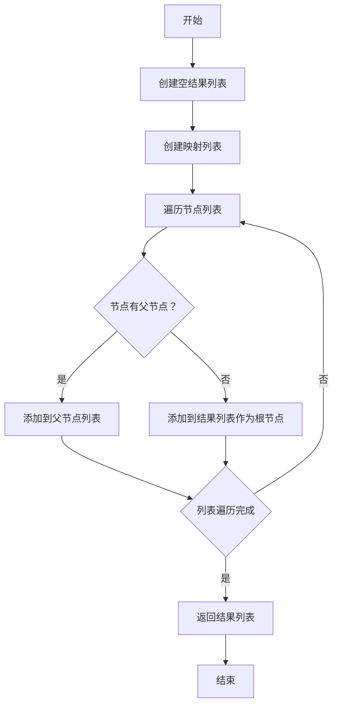

```component VPBanner
title: Java实现通用树形结构转换工具类
content: Java实现通用树形结构转换工具类
logo: 
color: var(--banner-text)
background: rgba(217, 244, 208, 0.5)
actions:
  - text: Java实现通用树形结构转换工具类
    link: /dev/Java实现通用树形结构转换工具类
```

# Java实现通用树形结构转换工具类

## 概述：

在软件开发中，树形结构的数据表现形式无处不在，从文件系统的目录树到组织架构的部门树，再到各类产品的分类结构。在处理这些具有层级关系的数据时，经常需要将它们转换为树形结构以方便展示和操作。Java 作为一门成熟的编程语言，提供了强大的集合框架，但并没有直接提供树形结构的转换工具。因此，开发者需要自己实现这样的功能，以满足业务需求。

## 正文：

本文将深入探讨如何在 Java 中实现一个通用的树形结构转换工具类 `TreeUtil`，以及如何定义一个灵活的节点接口 `TreeNode`。将从 `TreeNode` 接口的设计开始，解释其泛型参数的作用和设计意图。接着，将逐步构建 `TreeUtil` 类，展示如何使用它将扁平的数据集合转换为树形结构，并通过具体的代码示例说明它的使用方式。最后，将讨论这种转换工具的潜在用途和优化空间，帮助读者更好地理解和运用这些工具来处理层级数据。

首先，来看一下 `TreeNode` 接口的设计。这个接口定义了树形结构中每个节点所必须具备的基本方法：获取当前节点的唯一标识符 (`getId`)、获取父节点的标识符 (`getPid`)、获取和设置子节点列表 (`getChildren` 和 `setChildren`)。通过泛型 `<T, K>`，使得 `TreeNode` 接口能够灵活地适用于各种数据类型的节点，其中 `T` 代表节点标识符的类型，`K` 代表子节点的类型。

### 源码泛型接口：

```java
import java.util.List;
/**
 * @Author derek_smart
 * @Date 2024/6/27 9:00
 * @Description  泛型接口
 * `T`：通常用来表示节点的标识符（ID）的类型。例如，如果树中的每个节点都有一个唯一的整数ID，那么 `T` 可能是 `Integer` 类型。
 * `K`：通常用来表示节点的子节点类型。
 *  在一个典型的树结构中，子节点也是树节点的类型，因此 `K` 通常与 `TreeNode<T, K>` 本身类型相同，但也可以是任何其他类型。
 */
public interface TreeNode<T,K> {

    T getPid();

    T getId();

    List<K> getChildren();

    void setChildren(List<K> list);
}
```

构建 `TreeUtil` 类，它提供了将一组扁平数据转换为树形结构的静态方法 `toObjTree`。这个方法接受一个实现了 `TreeNode` 接口的集合，并返回构建好的树形结构。在内部，`TreeUtil` 使用了一个映射 (`Map`) 来快速查找节点，并建立父子关系。如果一个节点在映射中找到了其父节点，它就会被添加到父节点的子节点列表中；如果没有找到，它就被视为根节点。

### 源码工具类

```java
import com.alibaba.fastjson.JSON;
import com.alibaba.fastjson.JSONArray;
import com.alibaba.fastjson.JSONObject;
import com.google.common.collect.Lists;

import java.util.Collection;
import java.util.List;
import java.util.Map;
import java.util.function.Function;
import java.util.stream.Collectors;

/**
 * @Author derek_smart
 * @Date 2024/6/27 9:00
 * @Description 树状结构生成工具类
 * <p>
 */
public class TreeUtil {
    private TreeUtil() {
    }

    public static <T extends TreeNode> List<T> toObjTree(Collection<T> list) {
        List<T> result = Lists.newArrayList();
        Map<Object,T> map = list.stream().collect(Collectors.toMap(T::getId,Function.identity()));
        list.forEach(t->{
            if(map.containsKey(t.getPid())){
                if(map.get(t.getPid()).getChildren()==null){
                    map.get(t.getPid()).setChildren(Lists.newArrayList());
                }
                map.get(t.getPid()).getChildren().add(t);
            }else {
                result.add(t);
            }
        });
        return  result;
    }


    public static <T extends TreeNode> JSONArray toTree(Collection<T> list) {
        return toTree(list, "id", "pid", "children");
    }

    public static <T extends TreeNode> JSONArray toTree(Collection<T> list, String id, String pid, String children) {
        return listToTree(JSONArray.parseArray(JSON.toJSONString(list)), id, pid, children);
    }

    public static <PlainArea> JSONArray toTreeArea(Collection<PlainArea> list) {
        return listToTree(JSONArray.parseArray(JSON.toJSONString(list)), "id", "parentId", "children");
    }

    /**
     * listToTree
     * <p>方法说明<p>
     * 将JSONArray数组转为树状结构
     *
     * @param arr   需要转化的数据
     * @param id    数据唯一的标识键值
     * @param pid   父id唯一标识键值
     * @param child 子节点键值
     * @return JSONArray
     */
    public static JSONArray listToTree(JSONArray arr, String id, String pid, String child) {
        JSONArray r = new JSONArray();
        JSONObject hash = new JSONObject();
        //将数组转为Object的形式，key为数组中的id
        for (int i = 0; i < arr.size(); i++) {
            JSONObject json = (JSONObject) arr.get(i);
            hash.put(json.getString(id), json);
        }
        //遍历结果集
        for (int j = 0; j < arr.size(); j++) {
            //单条记录
            JSONObject aVal = (JSONObject) arr.get(j);
            //在hash中取出key为单条记录中pid的值
            JSONObject hashVP = (JSONObject) hash.get(aVal.get(pid).toString());
            //如果记录的pid存在，则说明它有父节点，将她添加到孩子节点的集合中
            if (hashVP != null) {
                //检查是否有child属性
                if (hashVP.get(child) != null) {
                    JSONArray ch = (JSONArray) hashVP.get(child);
                    ch.add(aVal);
                    hashVP.put(child, ch);
                } else {
                    JSONArray ch = new JSONArray();
                    ch.add(aVal);
                    hashVP.put(child, ch);
                }
            } else {
                r.add(aVal);
            }
        }
        return r;
    }
}
```

#### 流程图：




在这个流程图中，从开始节点（A）启动，然后创建一个空的结果列表（B）。接下来，创建一个映射表，用于快速查找节点的父节点（C）。在遍历节点列表（D）的过程中，对于每个节点，检查是否有对应的父节点（E）。如果有父节点，将当前节点添加到父节点的子节点列表中（F）。如果没有父节点，将当前节点添加到结果列表中，作为树的根节点（G）。然后继续遍历列表（H），直到所有节点都被处理。一旦列表遍历完成，返回构建好的树形结构的

`TreeUtil` 还提供了基于 `JSONArray` 的 `toTree` 方法，这是为了更好地与 JSON 数据格式集成，使得可以直接处理来自 RESTful API 或其他 JSON 数据源的数据。

在实际应用中，可能会遇到各种树形结构的数据转换需求。例如，可能需要构建一个组织架构树，其中包含部门和员工两种类型的节点。部门节点可以有子部门和员工作为其子节点，而员工节点则没有子节点。通过 `TreeUtil` 和 `TreeNode` 接口的灵活设计，可以轻松实现这样的需求。

最后，讨论了 `TreeUtil` 的潜在用途和优化空间。由于 `TreeUtil` 是基于 Java 泛型和集合框架构建的，它可以很容易地扩展和定制以适应不同的业务场景。同时，也需要注意性能优化，特别是在处理大量数据时。例如，可以考虑使用并行流 (`parallelStream()`) 来加速映射的构建过程，或者在构建树形结构时避免不必要的列表操作。

优化版：

```java
//优化版
public static <T extends TreeNode> List<T> toObjTree(Collection<T> list) {
    if (list == null || list.isEmpty()) {
        return new ArrayList<>();
    }

    // 使用 HashMap 预先初始化所有可能的父节点，并创建空的子节点列表
    Map<Object, T> map = new HashMap<>();
    for (T node : list) {
        map.put(node.getId(), node);
        node.setChildren(new ArrayList<>());  // 预先初始化
    }

    // 创建结果列表
    List<T> result = new ArrayList<>();

    // 构建树形结构
    for (T node : list) {
        T parent = map.get(node.getPid());
        if (parent !=null) {
            // 直接添加到父节点的子节点列表中
            parent.getChildren().add(node);
        } else {
            // 没有父节点的是根节点
            result.add(node);
        }
    }

    return result;
}
```

在这个优化版本中，在遍历列表之前初始化了所有节点的子节点列表，这样就不需要在每次发现 `getChildren` 为 `null` 时创建新的 `ArrayList`。此外，也避免了在每次迭代中使用 `containsKey` 来检查映射中是否存在父节点，因为可以直接尝试获取父节点，并检查返回值是否为 `null`。

• `TreeNode`：这是一个接口，定义了树节点必须实现的方法。它有两个泛型参数，`T` 代表节点ID的类型，`K` 代表子节点的类型。

- • `TreeUtil`：这是一个工具类，提供了一个静态方法 `toObjTree`，它接受一个 `TreeNode` 的集合并返回构建好的树形结构的根节点列表。
- • `MyNode`：这是 `TreeNode` 接口的一个具体实现，它用于创建树的节点。它有 `id` 和 `pid` 字段来标识节点本身和父节点，以及一个 `children` 列表来存储子节点。

## 总结：

`TreeUtil` 和 `TreeNode` 接口为处理层级数据提供了一个高效、灵活的解决方案。无论是在企业管理系统中构建组织架构，还是在电子商务平台中展示产品分类，这个工具类都能大大简化开发工作，并提高代码的可维护性。


<Share colorful service="email,qq,qzone,qrcode,weibo,telegram,twitter" />
